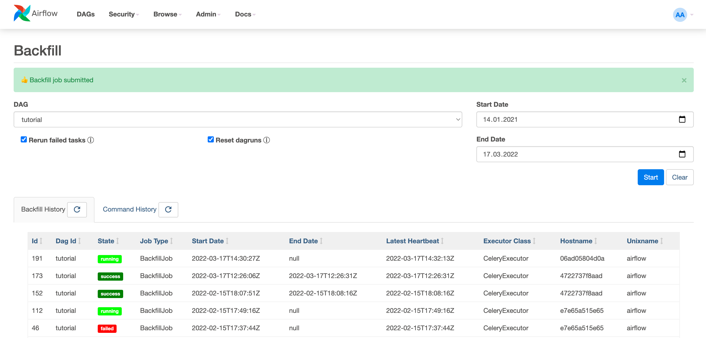
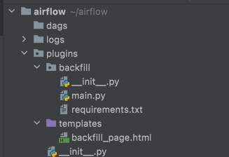
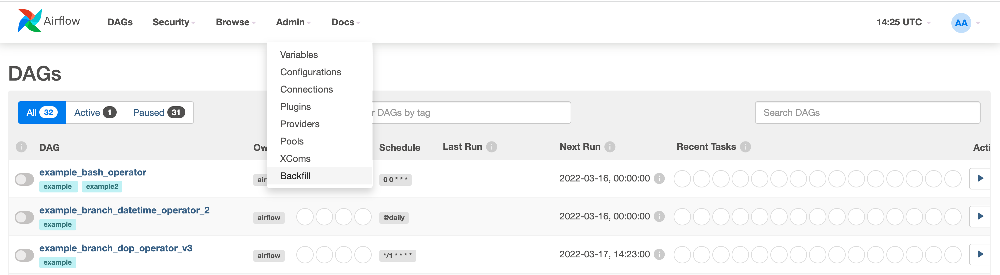
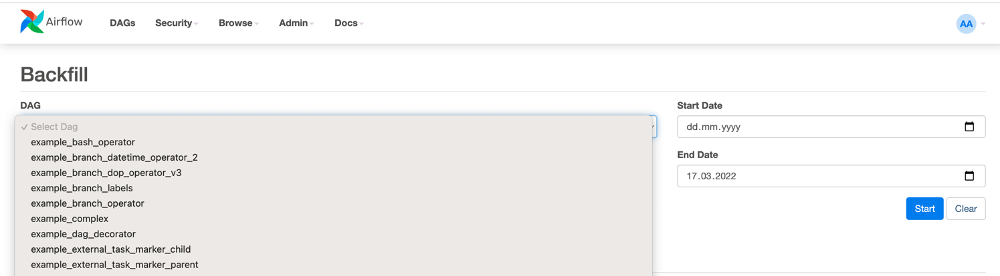
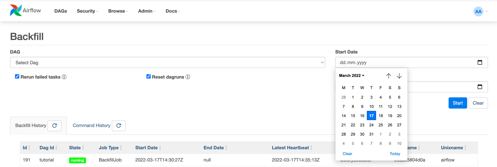
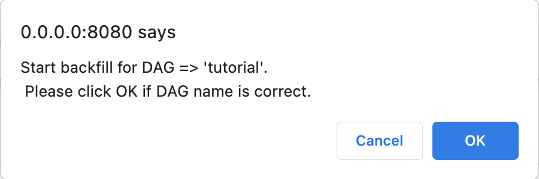
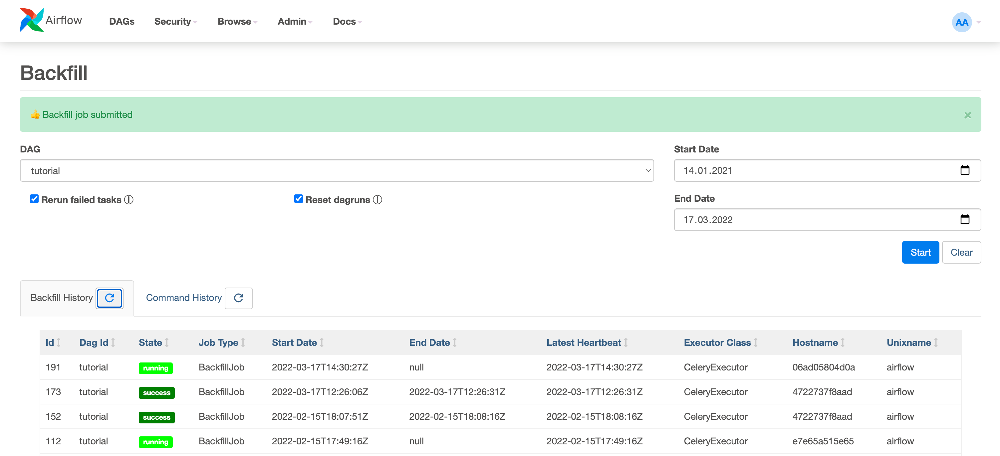
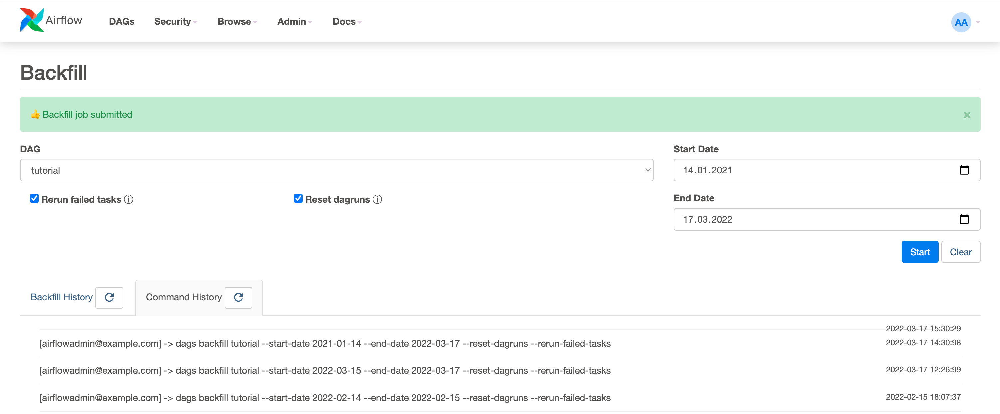

# airflow_backifll
An Airflow plugin, providing an admin UI to conveniently start and monitor backfills.

With this solution you can start backfills of arbitrary sizes.
Tested with backfills spanning multiple years. Now even non technical people can start backfills without the hassle of console commands and logging into vms.



## How to
### Setup the plugin
1. Clone the repository
2. Copy the contents of the plugins folder into the plugins folder inside of your airflow codebase
   - if you already have plugins installed, merge the \_\_init\_\_.py file with the existing one and copy the rest of the content into the folder.
3. Make sure the ./logs folder exists in your airflow codebase
4. Restart the webserver or set reload_on_plugin_change to True in the webserver configuration
5. Enjoy easy intuitive backfills, even for non technical people
* Sample Airflow codebase


### Test the plugin in a local container
Run the web service with docker.

```
docker-compose up 
```
Check http://localhost:8080/admin/backfill

username: airflow

password: airflow

To test legacy systems (Airflow 1) you can use 
docker-compose_airflow_1.yaml
### Start a backfill
In the Airflow UI, navigate to Admin/Backfill

Select the DAG from the dropdown

Select the Start Date and End Date

Click on Start after confirming that you have selected the right DAG and dates, then Confirm


After a couple of seconds, press refresh in the backfill history and the task should appear

In the Command History you can see the history of submitted commands, and the user who submitted it



## Tested with
* Airflow 2.2.3
* Airflow 1.10.9
* Airflow 2.1.4+composer